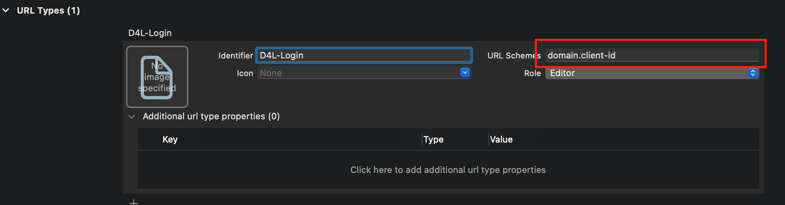

= Data4Life Core iOS SDK
:library_version: 1.17.0
:doctype: article
:!showtitle:
:toc: macro
:toclevels: 2
:toc-title:
:icons: font
:imagesdir: assets/images
:link-repository: https://github.com/d4l-data4life/d4l-sdk-ios
ifdef::env-github[]
:warning-caption: :warning:
:caution-caption: :fire:
:important-caption: :exclamation:
:note-caption: :paperclip:
:tip-caption: :bulb:
endif::[]

++++

    
<!-- PROJECT LOGO -->
        
    

    
<!-- PROJECT TITLE -->
        <h3>Data4Life Core iOS SDK</h3>
    

    
<!-- PROJECT DESCRIPTION -->
        Pure Swift API client for PHDP that automatically handles encryption
    

    
<!-- PROJECT DOCUMENTATION -->
        <a href="README.adoc"><strong>Explore the docs »</strong></a>
    

    
<!-- PROJECT ISSUES/FEATURES -->
        <a href="https://github.com/d4l-data4life/d4l-sdk-ios/issues">Report Bug</a>
        ·
        <a href="https://github.com/d4l-data4life/d4l-sdk-ios/issues">Request Feature</a>
    

    
<!-- PROJECT BADGES see badges.adoc how to change them -->
        
        
        
        
        
    

++++

[discrete]
=== Table Of Contents
toc::[]

== About The Project

Pure Swift API client for PHDP that automatically handles encryption.

== Installation

=== Swift Package Manager

To install with Swift package manager, select your project’s Swift Packages tab, and add our repository url, either as ssh or https url:

[source, terminal]
----
https://github.com/d4l-data4life/d4l-sdk-ios.git
----

OR

[source, terminal]
----
git@github.com:d4l-data4life/d4l-sdk-ios.git
----

In the next step, select the latest version, and then import the `Data4LifeSDK` framework in your target.

=== Configuration

To get started with the SDK, follow these steps:

. Configure the client information
. Handle the OAuth 2.0 redirect URL
. Display the login screen

This section describes the steps in more detail.

==== Configure the client information

This step is achieved by calling the configureWith methods on didFinishLaunchWithOptions. This must be the first SDK call or the client crashes.

NOTE: Client Id needs the `#ios` at the end in case it's missing, and the redirect URL string looks like `domain.com.client-id` without the need to have the `oauth://` suffix. For the complete settings for your client, refer to your json configuration file provided by us upon request. 

[source,swift]
----
import UIKit
import Data4LifeSDK

@UIApplicationMain
class AppDelegate: UIResponder, UIApplicationDelegate {

  var window: UIWindow?

  func application(_ application: UIApplication, didFinishLaunchingWithOptions launchOptions: [UIApplicationLaunchOptionsKey : Any]? = nil) -> Bool {

    let clientId = "client-id#ios"
    let secret = "secret"
    let redirectURLString = "app-redirect" // Must look like "domain.com.client-id"
    let environment = .staging // .development / .production
    let platform = .d4l //.s4h
    Data4LifeClient.configureWith(clientId: clientId,
                                  clientSecret: secret,
                                  redirectURLString: redirectURLString,
                                  environment: environment,
                                  platform: platform)

    return true
  }
}
----

==== Handle the OAuth 2.0 redirect URL in the `AppDelegate` or `SceneDelegate` class and in the info tab.

This step is achieved by calling the `handle(url:)` method on the main delegate. In case the app has no `SceneDelegate` set up, it must be added in the `open url:` method of the `AppDelegate`. 

[source, swift]
----
import UIKit
import Data4LifeSDK

@UIApplicationMain
class AppDelegate: UIResponder, UIApplicationDelegate {

  var window: UIWindow?

  func application(_ app: UIApplication, open url: URL, options: [UIApplicationOpenURLOptionsKey : Any] = [:]) -> Bool {

    Data4LifeClient.default.handle(url: url)

    return true
  }
}
----

If instead of the `AppDelegate` only, a `SceneDelegate` is present, the code needs to be handled at the `SceneDelegate` level, in the `openURLContexts` method: 

[source, swift]
----
import UIKit
import Data4LifeSDK

class SceneDelegate: UIResponder, UIWindowSceneDelegate {

    func scene(_ scene: UIScene, openURLContexts URLContexts: Set<UIOpenURLContext>) {
        guard let url = URLContexts.first?.url else {
            return
        }

        Data4LifeClient.default.handle(url: url)
    }
}
----

Last step for handling the login url is to enter the redirect url scheme in the Info tab of the app target setting: 

==== Display the login screen.

Afterwards, you can use it throughout the app with the default client by providing a view controller to present.

[source,swift]
----
let viewController = UIApplication.shared.keyWindow?.rootViewController
Data4LifeClient.default.presentLogin(on: viewController, animated: true) { result in
    switch result {
    case .success:
        // Handle success
    case .failure(let error):
        // Handle error
    }
}
----

Optional: To use the SDK inside extensions, provide the `keychainGroupId` identifier when you configure the SDK and enable the `KeychainSharing` capability in the Xcode project.
The SDK also requires the `AppGroups` capability with the same setup.

[source,swift]
----
func application(_ application: UIApplication, didFinishLaunchingWithOptions launchOptions: [UIApplicationLaunchOptionsKey : Any]? = nil) -> Bool {

    let clientId = "client-id#ios"
    let secret = "secret"
    let redirectURLString = "app-scheme"
    let environment = .staging
    let teamId = "TEAMDID"
    let groupId = "Group1"
    let keychainGroupId = "\(teamId).\(groupId)"
    let appGroupId= "group.unique.id"
    let platform = .d4l

    Data4LifeClient.configureWith(clientId: clientId,
                              clientSecret: secret,
                              redirectURLString: redirectURLString,
                              environment: .staging,
                              keychainGroupId: keychainGroupId,
                              appGroupId: appGroupId,
                              environment: environment,
                              platform: platform)

    return true
  }
----

== Documentation 

Further documentation on how to use it can be found link:docs/v1.15.0/index.html[here]

== Changelog

See link:CHANGELOG.adoc[changelog]

== Versioning

We use http://semver.org/[Semantic Versioning] as a guideline for our versioning.

Releases use this format: `{major}.{minor}.{patch}`

* Breaking changes bump `{major}` and reset `{minor}` & `{patch}`
* Backward compatible changes bump `{minor}` and reset `{patch}`
* Bug fixes bump `{patch}`

== Contributing

You want to help or share a proposal? You have a specific problem? Read the following:

* link:CODE-OF-CONDUCT.adoc[Code of conduct] for details on our code of conduct.
* link:CONTRIBUTING.adoc[Contributing] for details about how to report bugs and propose features.
* link:DEVELOPING.adoc[Developing] for details about our development process and how to build and test the project.

== Copyright and License

Copyright (c) 2021 D4L data4life gGmbH / All rights reserved. Please refer to our link:LICENSE[License] for further details.
